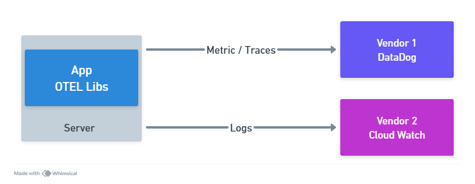
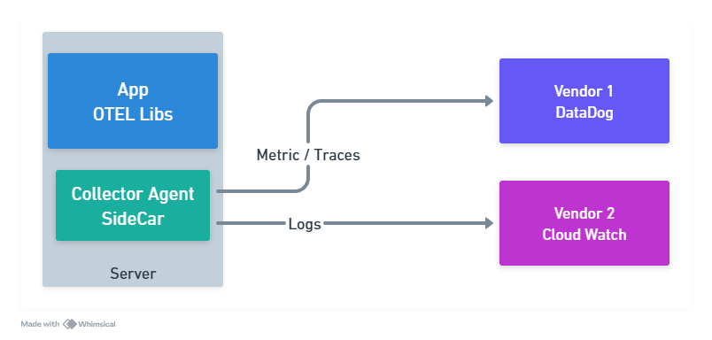
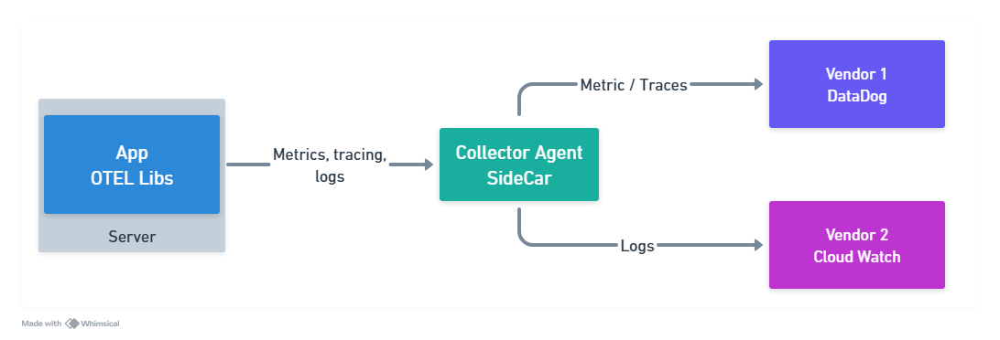

# Go-Observability

## Open Telemetry

Open Telemetry was created by the merger of Open Tracing and Open Census. It is a set of APIs, libraries, agents, and instrumentation to allow you to better understand what is happening in your applications. It is a CNCF project and is vendor neutral.

## What is Open Telemetry?

- A observability framework for cloud-native software
- A set of tools, APIs, and SDKs
- Instrumentation, collection, and visualization of telemetry data

## Open Telemetry Components

- **Specification**: Defines the API and SDK
- **Collector**: Get telemetry data from your application
  - Can be like a agent or a service
  - We can create pipelines to process the data
  - Vendor agnostic.
- **Libs**: Libraries to instrument your code
  - Vendor agnostic
  - Trace, metrics, and logs
  - Auto tracing
- **Logs**: Draft

## Architecture

### No Collector

- **Instrumentation**: Libraries to instrument your code should set up destinations to send data
- **No Collector**: There not are collector features, like aggregation, pipeline, etc.

### With Collector in Agent Mode

- **Instrumentation**: Libraries to instrument your code send data to the collector
- **Collector**: Agent mode
  - Acts like a sidecar, assigned to a specific application
  - Receives data from the instrumentation
  - Can be configured to send data to multiple destinations
  - Can be configured to process data (pipelines)

### With Collector in Service Mode

- **Instrumentation**: Libraries to instrument your code send data to the collector
- **Collector**: Service mode
  - Acts like a service, can be shared by multiple applications
  - Receives data from the instrumentation
  - Can be configured to send data to multiple destinations
  - Can be configured to process data (pipelines)

## Instrumentation

- **Auto Instrumentation**: Libraries to instrument your code automatically
- **Manual Instrumentation**: Libraries to instrument your code manually
